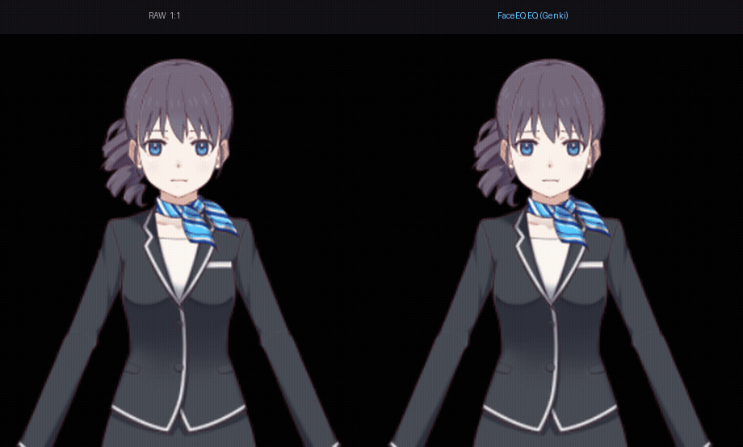

# FaceEQ

**VTuber 表情「情绪 EQ」中间件：任何面捕 ↔ FaceEQ ↔ 任何引擎。开源、本地处理、无遥测。**

把追踪软件送来的表情按情绪**差异化放大/抑制**——让角色表情更好认、更夸张，或按人设压平
某些情绪。补现有工具只做 1:1 跟踪、表情「太平」的空白。**自己不做面捕**：手机/平板 app、
PC 追踪软件，谁发 blendshape 就吃谁。


*同一份 TrueDepth 实录:左 = 原始追踪 1:1,右 = FaceEQ EQ(元气预设)。完整素材见 docs/marketing-kit.md。*

## 核心功能

- **情绪 EQ**：全局 gain + 每情绪增强/抑制滑块（+1 放大、−1 压成扑克脸 = persona），拖动实时生效；
- **跨形状耦合**：笑时眼笑追嘴笑（Duchenne 真笑）、悲时内眉抬追嘴角下垂——情绪条件下的联动，
  其他工具的独立滑块结构上做不到；
- **自定义复合表情**：「害羞」= happy 0.3 + surprised 0.4，自己定义、滑块实时激活，预设可存；
- **预设人设**：一键切换 元气/清冷/扑克脸/傲娇…（内置 8 个 ★ 预设开箱即用）；
- **语音情绪（实验）**：说话的音量/亮度给表情加偏置——挡脸、低头时表情依然生动；
- **情绪触发 VTS 热键**：大笑越阈值 → 自动贴纸/切表情（阈值+冷却）；
- **每张脸可校准**：11 表情向导，按你的脸实测每路增益；
- **多输出并发**：同时喂 VTS 和 Warudo，一套面捕两个形象。

## 输入 / 输出（纯协议，不锁定单一软件）

| 输入源 | 通道 |
|---|---|
| 📱 iFacialMocap（iOS，TrueDepth）/ MeowFace（安卓） | UDP 49983 |
| 📡 VSeeFace、Warudo 等 PC 追踪软件 | VMC 输入（UDP 39539） |

| 输出目标 | 适用软件 | 通道 |
|---|---|---|
| **VTS (Live2D)** | VTube Studio | WebSocket 参数注入 |
| **VMC** | Warudo、VNyan、VSeeFace、VRM/Unity/UE 系 | ARKit blendshape（OSC/UDP 39540） |
| **OSC 自定义** | VRChat（FT 桥）、任意 OSC 接收器 | 参数名映射表 |

## 和其他工具什么关系？

| 你想要 | 建议 |
|---|---|
| 只是把表情调大 | VTS 自带的参数范围重映射就够，不必装 FaceEQ |
| 表情**按情绪**差异化 / 人设一键切换 / 真笑耦合 / 多输出并发 | **FaceEQ**（这是它存在的理由） |
| iPhone 52 blendshape 注入 Live2D 自定义参数（模型重 rig） | VBridger（付费）/ Vitamins |

诚实说明：**模型 rig 是表情的上限**——rig 本身幅度小，EQ 只能放大已有幅度，不能无中生有；
**细微表情（sad/disgust）取决于你的面捕源**——TrueDepth 实测可用（见下），普通 webcam 追踪器偏弱。

## 上手

> Windows 10/11；Python 3.10–3.12。

**方式一（推荐）**：下载 Release 里的 `FaceEQ.zip` → 解压 → 双击 `FaceEQ.exe`。
首次启动有引导：准备面捕 app → 选输入源 → 校准（约 2 分钟）→ 勾输出 → 「开始」。
详见 [docs/quickstart.md](docs/quickstart.md)。

**方式二（源码）**：

```bash
py -3.12 -m venv .venv
.venv\Scripts\python.exe -m pip install -r requirements.txt
PYTHONUTF8=1 .venv\Scripts\python.exe gui.py
```

CLI（自动化/调试）：`main.py --input phone --output vts` 等，见 `main.py --help`。

## 实测数据（iPad TrueDepth，v0.2.0 验收）

撇嘴 → **sad 0.82**、皱鼻 → **disgust 0.64**、微笑 → **happy 1.00**（FaceEQ 公式实时估计）。
细微表情可用性取决于面捕源：TrueDepth 最强，普通 RGB 追踪器偏弱——以校准实测为准。
完整数据：[docs/acceptance-sprint1.md](docs/acceptance-sprint1.md)。

## 文档

- [快速上手（小白版）](docs/quickstart.md) / [English quickstart](README_EN.md)
- [FAQ / 排错](docs/faq.md)
- [输出目标：VTS / VMC / OSC](docs/outputs.md) —— 对接 Warudo/VNyans/VRChat 等
- [手机面捕](docs/phone-tracking.md) · [校准与 profile](docs/calibration.md) · [VTS 接入](docs/vts-setup.md)
- [产品定位（竞品对照）](docs/positioning.md) · [发布清单](RELEASE.md) · [架构](ARCHITECTURE.md)

## 状态与隐私

开发中（v0.2.0）。本项目只做本地处理，**无遥测、不发送任何数据**；MIT 开源。
喜欢的话欢迎 Star / [赞助链接位](RELEASE.md)。
